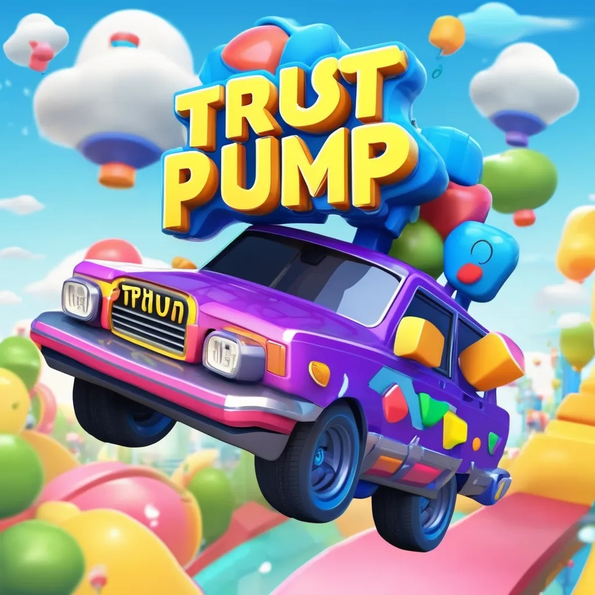

## trustpump.fun

We work hard to reduce pumpfun's rugged behavior and compensate for it.

### 1. X account must be verified. 
### 2. GitHub account must be verified.
### 3. Website must be verified.
### 4. After the contract is created, 10%~50 (dev select) of the supply is allocated to dev and automatically locked for 3 months.
### 5. create new coin 
       1 sol is used to create LP on Meteora DLMM, and burn. 
       Meteora can permanently lock liquidity and still compound and claim fees forever.
       1% of the transaction fee belongs to the DAO.
       DAO funds will repurchase $TPUMP regularly.

### 6. If it is rugged, $TPUMP will be airdropped to all users holding it as compensation. 
### 7. Users who create coins on the trustpump.fun platform will receive different $TPUMP rewards based on their transaction volume.
### 8. $TPUMP has not been issued yet and has no contract.

- <a> X </a>
- <a href="https://TrustPump.fun"> web </a>
- <a> telegram </a>
